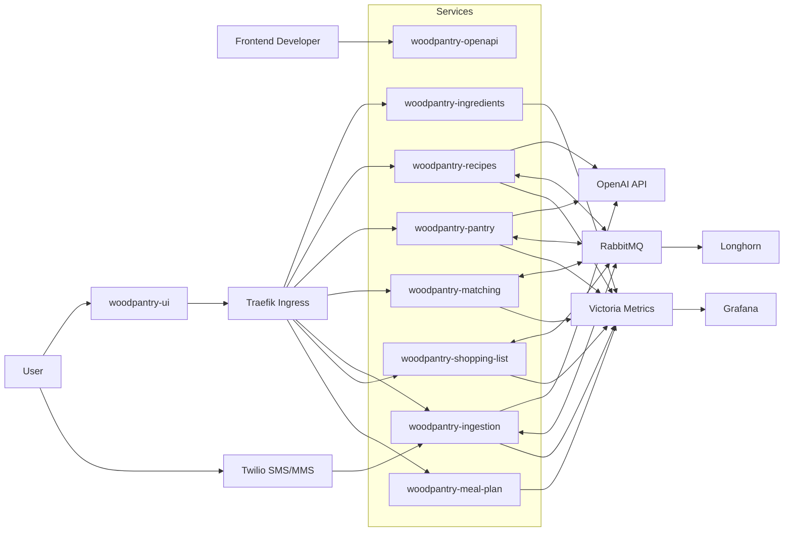
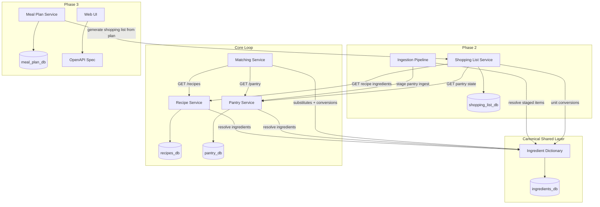
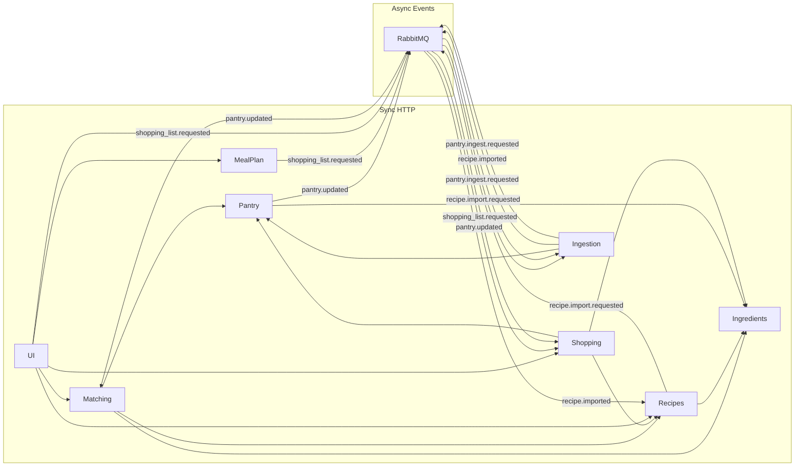
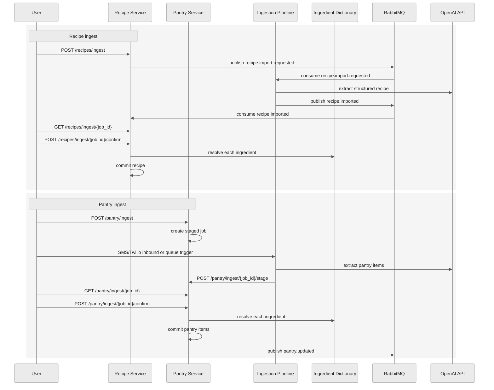

# WoodPantry

WoodPantry is a self-hosted pantry and recipe platform built as a microservices system for a GitOps-managed homelab Kubernetes cluster.

The core loop is:

1. Track what is in the pantry.
2. Store recipes with canonical ingredient linkage.
3. Match current pantry state against recipes.
4. Reduce pantry update friction with AI-assisted ingest.

The repo root is the planning, coordination, local-dev, and cross-service test hub for the wider WoodPantry ecosystem.

## Monorepo Role

This repository is the root coordination repo. It contains:

- phase planning and architecture docs
- root smoke tests for cross-service behavior
- local compose-based development entrypoints
- links to the service repos that live as sibling directories in this workspace

It does not contain every service's implementation inline in a single Go module. Each backend service remains its own repo/module with its own `README.md`, `CLAUDE.md`, `Dockerfile`, and `kubernetes/` manifests.

## Service Map

| Service | Role | Language | Phase |
|---|---|---|---|
| `woodpantry-ingredients` | Canonical ingredient dictionary, resolve/merge/substitutes/conversions | Go | Phase 1 |
| `woodpantry-recipes` | Recipe CRUD, staged ingest jobs, recipe corpus | Go | Phase 1 |
| `woodpantry-pantry` | Pantry CRUD, staged pantry ingest jobs, pantry state | Go | Phase 1 |
| `woodpantry-matching` | Stateless recipe-to-pantry matching | Go | Phase 1 |
| `woodpantry-ingestion` | Async ingest pipeline, OpenAI extraction, Twilio flow | Python | Phase 2 |
| `woodpantry-shopping-list` | Aggregated shopping list generation | Go | Phase 2 |
| `woodpantry-openapi` | Central OpenAPI 3.x contract | Docs/spec | Phase 2 |
| `woodpantry-meal-plan` | Weekly meal planning service | TBD | Phase 3 |
| `woodpantry-ui` | Web frontend | Frontend stack TBD | Phase 3 |

## Repository Layout

```text
woodpantry/
├── local/                     # Docker/Podman Compose stack + env config
├── tests/                     # Cross-service smoke tests
├── BUGS.md                    # Smoke-test-discovered integration regressions
├── TODO.md                    # Backlog and implementation plan
├── CRAWL.md                   # Phase 1 plan
├── WALK.md                    # Phase 2 plan
├── RUN.md                     # Phase 3 plan
├── CLAUDE.md                  # Root engineering conventions
├── woodpantry-ingredients/
├── woodpantry-recipes/
├── woodpantry-pantry/
├── woodpantry-matching/
├── woodpantry-ingestion/
├── woodpantry-shopping-list/
├── woodpantry-openapi/
├── woodpantry-meal-plan/
└── woodpantry-ui/
```

## Architecture Principles

- Each service owns its own Postgres database.
- No service reads another service's database directly.
- Synchronous calls use HTTP.
- Asynchronous workflows use RabbitMQ.
- The Ingredient Dictionary is the canonical shared ingredient layer.
- The Ingestion Pipeline is the only service that handles raw or dirty input.
- Ingest flows use staged commit: raw input -> extraction -> staged result -> confirm -> commit.
- Go services use `chi` + `sqlc`; no ORM.

## Twilio Webhook Operations

`woodpantry-ingestion` is the only public SMS ingress. The deployable webhook path is `POST /twilio/inbound`.

Route model:

- Local development: Twilio -> public tunnel -> `http://127.0.0.1:8085/twilio/inbound`
- Cluster: Twilio -> Traefik public host -> `ingestion` Service -> ingestion pod -> `/twilio/inbound`

Operator requirements:

- Local credentials belong in `local/.env` using the `TWILIO_ACCOUNT_SID`, `TWILIO_AUTH_TOKEN`, and `TWILIO_FROM_NUMBER` variables documented in `local/.env.example`.
- Cluster credentials belong in the `twilio-secret` Secret in the `woodpantry` namespace.
- The public cluster route is defined in [`woodpantry-ingestion/kubernetes/ingressroute.yaml`](/home/maxw/dev/woodpantry/woodpantry-ingestion/kubernetes/ingressroute.yaml).
- Live Twilio usage stays out of automated tests; manual verification uses a tunnel or the public cluster host.

## Complete Architecture

### System Context



### Service and Data Ownership



### HTTP and Event Flows



### Pantry and Recipe Ingest Architecture



## Phase Breakdown

### Phase 1: `CRAWL`

Goal: deliver the core loop with four services:

- `woodpantry-ingredients`
- `woodpantry-recipes`
- `woodpantry-pantry`
- `woodpantry-matching`

Primary user value:

- add pantry items
- create and ingest recipes
- see what can be cooked right now

Reference: [`CRAWL.md`](./CRAWL.md)

### Phase 2: `WALK`

Goal: reduce pantry update friction and add async infrastructure:

- RabbitMQ event backbone
- `woodpantry-ingestion`
- Twilio-based SMS ingest
- `woodpantry-shopping-list`
- `woodpantry-openapi`

Reference: [`WALK.md`](./WALK.md)

### Phase 3: `RUN`

Goal: add the AI-heavy and product-facing layer:

- semantic recipe search
- receipt photo OCR
- `woodpantry-ui`
- `woodpantry-meal-plan`

Reference: [`RUN.md`](./RUN.md)

## Technology Stack

### Backend

- Go for all backend services except ingestion
- Python for `woodpantry-ingestion`
- `chi` for HTTP routing
- `sqlc` for database access
- PostgreSQL per service
- RabbitMQ for async workflows

### AI and Messaging

- OpenAI API
- `gpt-5-mini` for text extraction
- `gpt-5` for vision/OCR in Phase 3
- `text-embedding-3-small` for embeddings in Phase 3
- Twilio for SMS and MMS ingress

### Platform

- Kubernetes
- Traefik ingress
- Longhorn persistent storage
- Victoria Metrics
- Grafana
- GitOps deployment flow

## Local Development

From the repo root:

```bash
make dev
make dev-restart
make dev-down
make test
make test-only
make test-rabbitmq-restart
make test-rabbitmq-redelivery
make test-rabbitmq-app-consumer-restart
bash tests/smoke_rabbitmq.sh
bash tests/smoke_rabbitmq_restart.sh
bash tests/smoke_rabbitmq_redelivery.sh
bash tests/smoke_rabbitmq_app_consumer_restart.sh
```

What those do:

- `make dev`: start the local stack, including `woodpantry-shopping-list` on `:8086`
- `make dev-restart`: rebuild and restart the local stack from the root `Makefile`
- `make dev-down`: tear the stack down
- `make test`: start stack, run smoke tests, tear down
- `make test-only`: run smoke tests against an already-running stack
- `make test-rabbitmq-restart`: run the opt-in broker restart durability verification from the root `Makefile`
- `make test-rabbitmq-redelivery`: run the opt-in consumer crash/redelivery verification from the root `Makefile`
- `make test-rabbitmq-app-consumer-restart`: run the opt-in application-consumer restart verification for `woodpantry-recipes` consuming a queued `recipe.imported` event
- `bash tests/smoke_rabbitmq.sh`: prove local RabbitMQ exchange/queue wiring and `pantry.updated` routing without running the full suite
- `bash tests/smoke_rabbitmq_restart.sh`: restart the local broker and verify a durable queue plus a persistent message survive without resetting volumes
- `bash tests/smoke_rabbitmq_redelivery.sh`: crash a temporary consumer before `ack` and verify the same message is redelivered to a replacement consumer
- `bash tests/smoke_rabbitmq_app_consumer_restart.sh`: stop ingestion, create a recipe ingest job, queue a synthetic `recipe.imported` event while recipes is stopped, restart recipes, and verify the job becomes staged

RabbitMQ verification is intentionally split by scope:

- `tests/smoke_rabbitmq.sh`: broker reachability, topology, direct publish/get, and `pantry.updated` routing
- `tests/smoke_rabbitmq_restart.sh`: broker durability across a RabbitMQ container restart
- `tests/smoke_rabbitmq_redelivery.sh`: unacked-message requeue and redelivery after a consumer process crash
- `tests/smoke_rabbitmq_app_consumer_restart.sh`: real `woodpantry-recipes` consumer recovery for queued `recipe.imported` after service restart

What remains outside these proofs:

- Kubernetes pod restart behavior in cluster environments
- handler idempotency and duplicate-safe replay of duplicate real application messages

## Testing Strategy

Testing is intentionally split by responsibility:

- service repos own unit and integration tests
- this root repo owns cross-service smoke tests

See:

- [`tests/SMOKE_TESTS.md`](./tests/SMOKE_TESTS.md)
- [`BUGS.md`](./BUGS.md)
- [`TODO.md`](./TODO.md)

## Engineering Conventions

- Use `sqlc`, not an ORM.
- Keep service boundaries strict.
- Do not read another service's database.
- Resolve ingredients through the Dictionary instead of duplicating canonical data.
- Keep dirty input handling inside `woodpantry-ingestion`.
- Keep root docs current when architecture or contracts change.

## Related Docs

- [`STATUS.md`](./STATUS.md): current user-journey and service status dashboard
- [`CLAUDE.md`](./CLAUDE.md): root engineering conventions
- [`TODO.md`](./TODO.md): implementation backlog
- [`BUGS.md`](./BUGS.md): smoke-test-discovered bugs only
- [`CRAWL.md`](./CRAWL.md): Phase 1 plan
- [`WALK.md`](./WALK.md): Phase 2 plan
- [`RUN.md`](./RUN.md): Phase 3 plan
